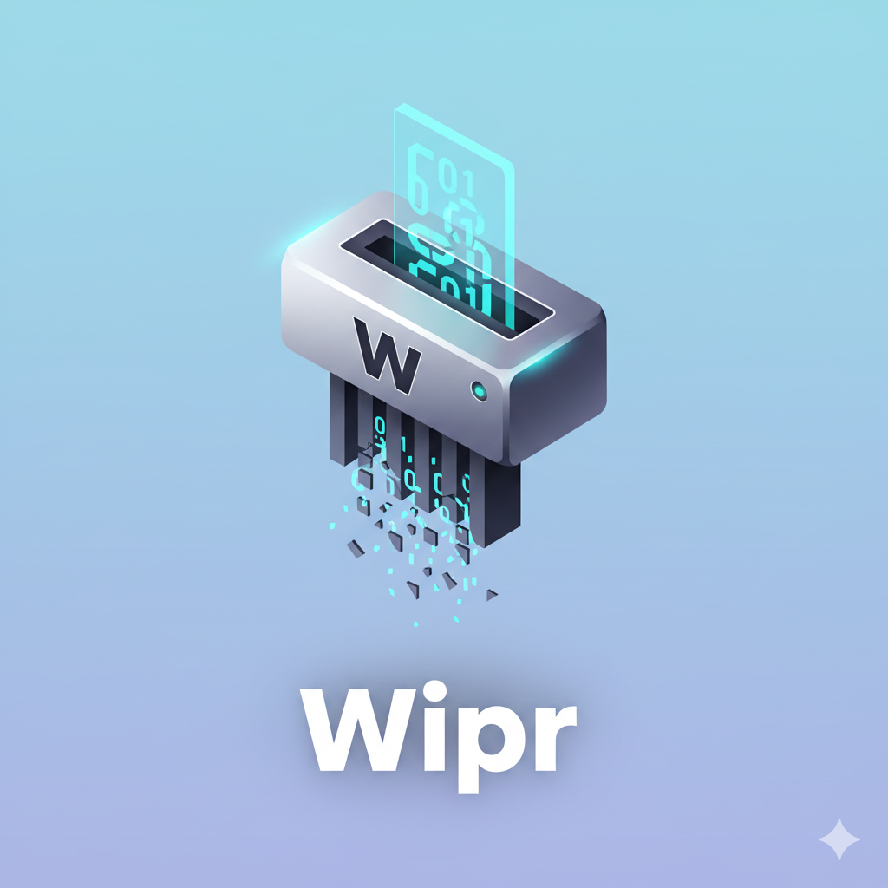

# Wipr



Wipr is a desktop application for securely wiping data from drives and partitions, built with Go and the [Fyne](https://fyne.io/) toolkit.

## Features

*   **Cross-Platform:** Runs on Windows and Linux.
*   **Drive & Partition Selection:** Easily select a target drive or partition from a dropdown list.
*   **Secure Deletion:** Implements secure data wiping methods. (Not implemented until this commit)
*   **System Tray Integration:** Runs in the background with a system tray icon for quick access.
*   **User-Friendly Interface:** A clean and simple UI with clear warnings to prevent accidental data loss.

## Getting Started

### Prerequisites

*   Go 1.24 or later
*   Platform specific dependencies for Fyne can be found [here](https://docs.fyne.io/started)

### Building from Source

1.  Clone the repository:
    ```sh
    git clone https://github.com/US-BEE-SIH/Wipr.git
    cd wipr
    ```
2.  Install dependencies:
    ```sh
    go mod tidy
    ```
3.  Install Fyne CLI
    ```sh
    go install fyne.io/tools/cmd/fyne@latest
    ```
4.  Generate go files
    ```sh
    go generate
    ```
5.  Build<br>
    1. If building for Linux on Linux or Windows on Windows
        ```sh
        fyne package
        ```
    2. For cross-platform building
        ```sh
        go install https://github.com/fyne-io/fyne-cross
        fyne-cross <platform> -arch=<cpu_arch> -tags <platform>
6.  Run the executable:
    1. If built with fyne-cross<br>
        `./fyne-cross/bin/[platform]-[arch]/Wipr.exe`
    2. If built without fyne-cross
        * Windows: `.\Wipr.exe`
        * Linux: `./wipr`

## Dependencies

*   [Fyne.io](https://github.com/fyne-io/fyne): The GUI toolkit used for the user interface.
*   [jaypipes/ghw](https://github.com/jaypipes/ghw): A hardware inspection and discovery library, used to list drives and partitions.
*   [zalando/go-keyring](github.com/zalando/go-keyring): For managing verification token via platform keyrings

## Warning

**This application is intended to permanently delete data. Data deleted by Wipr is unrecoverable. The developers are not responsible for any data loss resulting from user error. Please use with extreme caution.**

## License

This project is licensed under the MIT License - see the [LICENSE](LICENSE) file for details.
